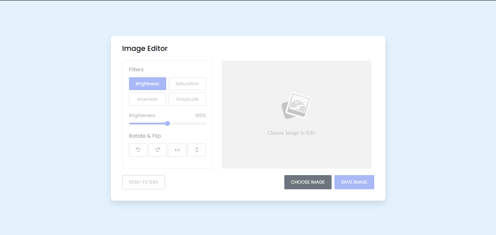

# Image Editor  
A simple and intuitive web-based image editor that allows users to apply filters, rotate, flip, and save images. Built with **HTML**, **CSS**, and **JavaScript**, this lightweight tool offers essential image editing functionalities, making it easy to modify and save images directly from the browser.

## Features  
- **Filters**:  
  - Adjust brightness, saturation, inversion, and grayscale.
- **Rotate & Flip**:  
  - Rotate left or right by 90 degrees.  
  - Flip images horizontally or vertically.
- **Image Loading & Saving**:  
  - Load images from your device.  
  - Save edited images in JPEG format.
- **Reset Filters**: Quickly reset all filters to their default values.

## Demo  
Add screenshots or GIFs of the project in action here.  
Example:  


## How to Use  
1. **Load an Image**  
   - Click the **"Choose Image"** button to upload an image from your device.  
2. **Apply Filters and Adjustments**  
   - Use the filter buttons to select a filter (brightness, saturation, inversion, grayscale).  
   - Adjust the filter intensity with the slider.  
   - Use the rotate and flip buttons to change the orientation.  
3. **Save the Edited Image**  
   - Click **"Save Image"** to download the edited image.  
4. **Reset Filters**  
   - Use the **"Reset Filters"** button to revert all changes.

## Installation  
1. Clone the repository:  
   ```bash
   git clone https://github.com/Aisha-Fathima/Image-Editor-2.0.git
   cd Image-Editor-2.0
   ```
2. Open the project in a browser:  
   ```bash
   open index.html
   ```

## Project Structure  
```
📦 Image Editor  
├── index.html          # Main HTML file  
├── style.css           # CSS for styling  
├── script.js           # JavaScript logic  
└── image-placeholder.svg  # Placeholder image for preview  
```

## Dependencies  
- [Boxicons](https://boxicons.com/)  
- [Font Awesome](https://fontawesome.com/)  

## Code Snippets  
Here’s a glimpse of the JavaScript used to apply filters dynamically:  
```javascript
const updateFilter = () => {
    filterValue.innerText = `${filterSlider.value}%`;
    const selectedFilter = document.querySelector(".filter .active");

    if (selectedFilter.id === "brightness") {
        brightness = filterSlider.value;
    } else if (selectedFilter.id === "saturation") {
        saturation = filterSlider.value;
    } else if (selectedFilter.id === "inversion") {
        inversion = filterSlider.value;
    } else {
        grayscale = filterSlider.value;
    }
    applyFilter();
};
```

## Future Improvements  
- Add more filters (e.g., contrast, blur, hue rotation).  
- Implement drag-and-drop image upload.  
- Add a preview zoom feature.

